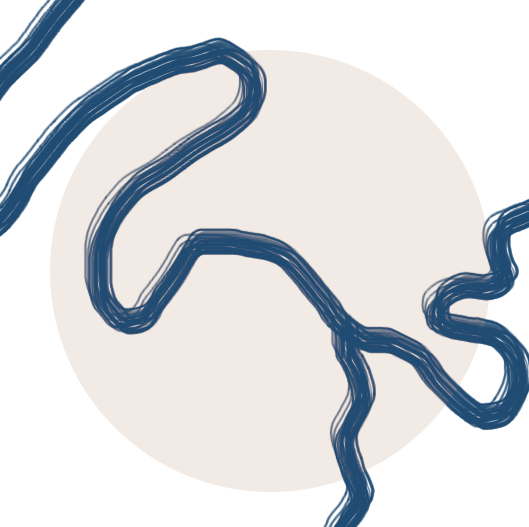
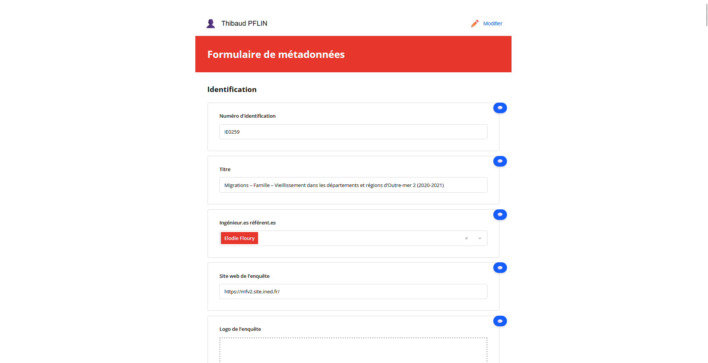

<!-- PROJECT LOGO -->
<br />
<div align="center">
  <a href="https://github.com/github_username/repo_name">
    
  </a>

<h3 align="center">FLUVIAL</h3>

  <p align="center">
    Metadata Editor form researcher input to DDI
    <!--
    <br />
    <a href="https://github.com/github_username/repo_name"><strong>Explore the docs »</strong></a>
    <br />
    <br />
    <a href="https://github.com/github_username/repo_name">View Demo</a>
    &middot;
    <a href="https://github.com/github_username/repo_name/issues/new?labels=bug&template=bug-report---.md">Report Bug</a>
    &middot;
    <a href="https://github.com/github_username/repo_name/issues/new?labels=enhancement&template=feature-request---.md">Request Feature</a>
    -->
  </p>
</div>

[![Next][Next.js]][Next-url]
[![React][React.js]][React-url]


<!-- TABLE OF CONTENTS -->
<details>
  <summary>Table of Contents</summary>
  <ol>
    <li>
      <a href="#about-the-project">About The Project</a>
    </li>
    <li>
      <a href="#getting-started">Getting Started</a>
      <ul>
        <li><a href="#prerequisites">Prerequisites</a></li>
        <li><a href="#installation">Installation</a></li>
        <li><a href="#start-application">Start application</a></li>
      </ul>
    </li>
    <li>
      <a href="#usage">Usage</a>
      <ul>
        <li><a href="#admin-interface">Administrative Interface</a></li>
      </ul>
    </li>
    <li><a href="#architecture">Architecture</a></li>
    <li><a href="#contributing">Contributing</a></li>
    <li><a href="#license">License</a></li>
    <li><a href="#contact">Contact</a></li>
  </ol>
</details>

<!-- ABOUT THE PROJECT -->
## About The Project



FLUVIAL is a application created by [French Institute for Demographic Studies (INED)](https://ined.fr), aiming to help collaborative documenting of the institution surveys', ultimately generate [DDI](https://ddialliance.org/) Codebook files.


To add when the github is created :  `github_username`, `repo_name`

<p align="right">(<a href="#readme-top">back to top</a>)</p>


<!-- GETTING STARTED -->
## Getting Started


### Prerequisites

For this application you'll need [NodeJS](https://nodejs.org/fr) and NPM installed on your computer/server.


npm
  ```sh
  npm install npm@latest -g
  ```

### Installation


1. Clone the repo in the place you want to hosts your app
   ```sh
   git clone https://github.com/github_username/repo_name.git
   ```
2. Add admin JSON file by copying `example.admins.json` to `admins.json` in data folder and change your credentials.
   ```sh
   cp data/example.admins.json data/admins.json
   sed -i -e 's/user@example.com/MYEMAIL/g' data/admins.json
   sed -i -e 's/password/MYNEWSTRONGPASSWORD/g' data/admins.json
   ```
3. Install NPM packages
   ```sh
   npm i
   ```
4. Build the website
   ```sh
   npm run build
   ```

🎉 Well done, you're ready to document your survey !

### Start application

If you want to run the application locally, you can use the following :

```sh
  npm run start
```

<p align="right">(<a href="#readme-top">back to top</a>)</p>


<!-- USAGE EXAMPLES -->
## Usage

### Admin Interface
You can access to the adinistration of the website by going to the following URL : **https://[your-webiste]/admin**

<p align="right">(<a href="#readme-top">back to top</a>)</p>

## Architecture
```
metadata-template/
└── src/
    ├── app/
    │   ├── admin/                        # Admin Interface
    │   │   └── page.tsx
    │   ├── api/
    │   │   ├── admin/
    │   │   │   └── instances/            # CRUD instances (admin only)
    │   │   │       └── route.ts
    │   │   └── survey/
    │   │       ├──[token]/               # Survey access by secret token
    │   │       │   ├── comments/
    │   │       │   │   ├──[commentId]/   
    │   │       │   │   │   └── route.ts  # Comment suppression
    │   │       │   │   └── route.ts      # Comment creation and read
    │   │       │   ├── export/
    │   │       │   │   └── route.ts      # Export JSON
    │   │       │   └── route.ts
    │   │       └── save/                 # Reponses save
    │   │           └── route.ts
    │   ├── survey/
    │   │   └──[token]/                   # User Interface (Questionaire)
    │   │       └── page.tsx
    │   └── page.tsx                      # Home Page
    ├── components/
    │   ├── CommentThread.tsx             # Comments component
    │   ├── Survey.tsx                    # SurveyJS component
    │   └── UserHeader.tsx                # Header display for name management
    ├── data/
    │   ├── responses/                    # Responses list
    │   │   └──[token]/                   # Survey Token
    │   │       ├── comments.json         # Comments of survey
    │   │       └── responses.json        # Responses of Survey
    │   ├── survey-template.json          # Template questionnaire
    │   ├── instances.json                # Instances
    │   └── admins.json                   # Tokens admin
    ├── lib/
    │   ├── commentService.ts             # Service to handle comments
    │   ├── cookiesUtils.ts               # Service to handle user comment
    │   └── saveUtils.ts                  # Service to handle JSON files writing/reading
    └── types/
        └── index.ts
```


<!-- CONTRIBUTING -->
## Contributing

Contributions are what make the open source community such an amazing place to learn, inspire, and create. Any contributions you make are **greatly appreciated**.

If you have a suggestion that would make this better, please fork the repo and create a pull request. You can also simply open an issue with the tag "enhancement".
Don't forget to give the project a star! Thanks again!

1. Fork the Project
2. Create your Feature Branch (`git checkout -b feature/AmazingFeature`)
3. Commit your Changes (`git commit -m 'Add some AmazingFeature'`)
4. Push to the Branch (`git push origin feature/AmazingFeature`)
5. Open a Pull Request

<p align="right">(<a href="#readme-top">back to top</a>)</p>

### Top contributors:

<a href="https://github.com/github_username/repo_name/graphs/contributors">
  
</a>


<!-- LICENSE -->
## License

Distributed under the project_license. See `LICENSE.txt` for more information.

<p align="right">(<a href="#readme-top">back to top</a>)</p>


<!-- CONTACT -->
## Contact

Thibaud Ritzenthaler - thibaud.ritzenthaler@ined.fr

Project Link: [https://github.com/github_username/repo_name](https://github.com/github_username/repo_name)

<p align="right">(<a href="#readme-top">back to top</a>)</p>


<!-- MARKDOWN LINKS & IMAGES -->
<!-- https://www.markdownguide.org/basic-syntax/#reference-style-links -->
[contributors-shield]: https://img.shields.io/github/contributors/github_username/repo_name.svg?style=for-the-badge
[contributors-url]: https://github.com/github_username/repo_name/graphs/contributors
[forks-shield]: https://img.shields.io/github/forks/github_username/repo_name.svg?style=for-the-badge
[forks-url]: https://github.com/github_username/repo_name/network/members
[stars-shield]: https://img.shields.io/github/stars/github_username/repo_name.svg?style=for-the-badge
[stars-url]: https://github.com/github_username/repo_name/stargazers
[issues-shield]: https://img.shields.io/github/issues/github_username/repo_name.svg?style=for-the-badge
[issues-url]: https://github.com/github_username/repo_name/issues
[license-shield]: https://img.shields.io/github/license/github_username/repo_name.svg?style=for-the-badge
[license-url]: https://github.com/github_username/repo_name/blob/master/LICENSE.txt
[product-screenshot]: images/screenshot.png
<!-- Shields.io badges. You can a comprehensive list with many more badges at: https://github.com/inttter/md-badges -->
[Next.js]: https://img.shields.io/badge/Next.js-black?logo=next.js&logoColor=white
[Next-url]: https://nextjs.org/
[React.js]: https://img.shields.io/badge/React-%2320232a.svg?logo=react&logoColor=%2361DAFB
[React-url]: https://reactjs.org/
